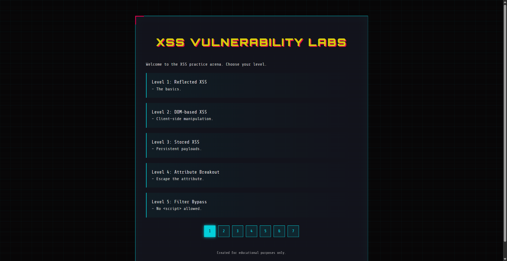
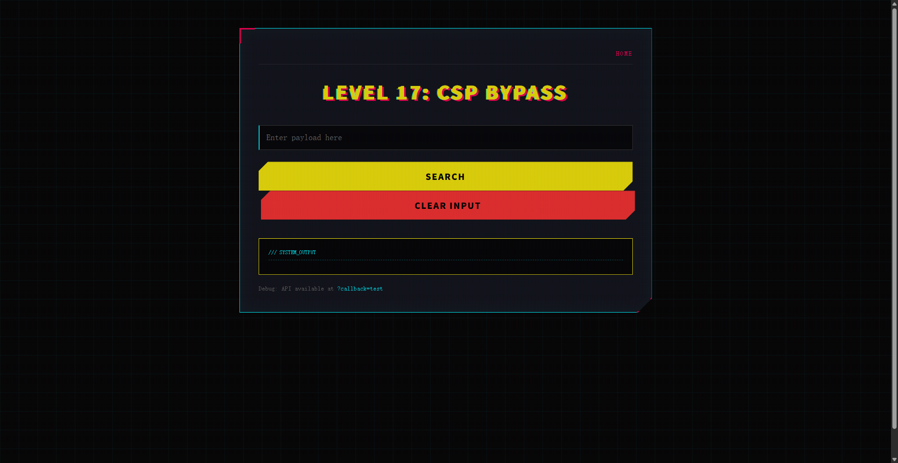
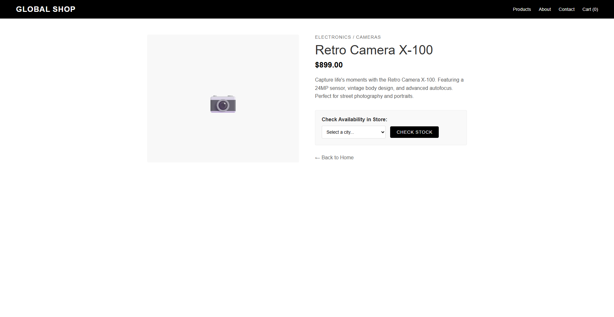

# XSS-Sec Lab Project

[中文版](README-CN.md)

This project is a practice arena for XSS vulnerabilities with a “real-world oriented” design, covering reflected, stored, DOM-based, SVG, CSP, framework injection, protocol bypass and more. Unified styling and clear logic make it suitable for systematic learning and teaching demonstrations.

## Quick Start
- Dependencies: PHP 7+ recommended, Chrome (some labs are Chrome-specific)
- Launch (built-in server example):
  - Switch terminal to project root (e.g. `d:\Book\XSS-Sec`)
  - Run PHP server: `php -S 127.0.0.1:3000`
  - Visit: `http://127.0.0.1:3000/index.php`
- Other: You can also use Nginx/Apache pointing to the project root (ensure .php executes)

## Project Structure
- `index.php`: Homepage with pagination listing all labs and links
- `headers.php`: Global HTTP response headers (intentionally relaxed for teaching)
- `assets/`: Frontend assets (`style.css`, `angular.min.js`, `admin-bot.js`, etc.)
- `levelXX/`: Lab directories (each with its own `index.php`)
- `writeup.md`: Per-lab code audit and walkthrough

## Important Notes
- Security: Some pages are intentionally exploitable for teaching; do not deploy in production
- Browser compatibility: Certain labs rely on specific browsers (e.g. Level 34 on Chrome)
- CSP/CORS: `headers.php` sets experimental headers for exercises and demo interaction

## Lab Overview (Names and Summaries)
- Level 1: Reflected XSS — The basics.
- Level 2: DOM-based XSS — Client-side manipulation.
- Level 3: Stored XSS — Persistent payloads.
- Level 4: Attribute Breakout — Escape the attribute.
- Level 5: Filter Bypass — No <script> allowed.
- Level 6: Quote Filtering — Break out of single quotes.
- Level 7: Keyword Removal — Double write bypass.
- Level 8: Encoding Bypass — HTML entities are your friend.
- Level 9: URL Validation — Must contain http://
- Level 10: Protocol Bypass — Case sensitivity matters.
- Level 11: JS Context — Break out of JS string.
- Level 12: DOM XSS via Hash — The server sees nothing.
- Level 13: Frontend Filter — Bypass the regex.
- Level 14: Double Encoding — Double the trouble.
- Level 15: Framework Injection — AngularJS Template Injection.
- Level 16: PostMessage XSS — Talk to the parent.
- Level 17: CSP Bypass — Strict CSP? Find a gadget.
- Level 18: Anchor Href XSS — Stored XSS in href.
- Level 19: DOM XSS in Select — Break out of select.
- Level 20: jQuery Anchor XSS — DOM XSS in jQuery attr().
- Level 21: JS String Reflection — Reflected XSS in JS string.
- Level 22: Reflected DOM XSS — Server reflection + Client sink.
- Level 23: Stored DOM XSS — Replace only once.
- Level 24: WAF Bypass (Tags/Attrs) — Reflected XSS with strict WAF.
- Level 25: SVG Animate XSS — SVG-specific vector bypass.
- Level 26: Canonical Link XSS — Escaping single quotes issue.
- Level 27: Stored XSS in onclick — Entities vs escaping pitfall.
- Level 28: Template Literal XSS — Reflected into JS template string.
- Level 29: Cookie Exfiltration — Stored XSS steals session cookie.
- Level 30: Angular Sandbox Escape — No strings, escape Angular sandbox.
- Level 31: AngularJS CSP Escape — Bypass CSP and escape Angular sandbox.
- Level 32: Reflected XSS (href/events blocked) — Bypass via SVG animate to set href.
- Level 33: JS URL XSS (chars blocked) — Reflected XSS in javascript: URL with chars blocked.
- Level 34: CSP Bypass (report-uri token) — Chrome-only CSP directive injection via report-uri.
- Level 35: Upload Path URL XSS — Independent lab: upload HTML, random rename, URL concat XSS.
- Level 36: Hidden Adurl Reflected XSS — Independent lab: hidden ad anchor reflects adurl/adid.
- Level 37: Data URL Base64 XSS — Blacklist filter; must use data:text/html;base64 in object.
- Level 38: PDF Upload XSS — Independent lab: upload PDF, view opens HTML-in-PDF causing XSS.
- Level 39: Regex WAF Bypass — src/="data:..." bypasses WAF regex.
- Level 40: Bracket String Bypass — href reflects; use window["al"+"ert"] to evade WAF.
- Level 41: Fragment Eval/Window Bypass — Echo HTML; split strings then eval or window[a+b].
- Level 42: Login DB Error XSS — Independent lab: invalid DB shows error, SQL reflects username.
- Level 43: Chat Agent Link XSS — Independent lab: chat echoes, agent clicks user link executes.
- Level 44: CSS Animation Event XSS — Strong WAF: only @keyframes+xss onanimationend allowed.
- Level 45: RCDATA Textarea Breakout XSS — Strong WAF: only textarea/title RCDATA breakout works.
- Level 46: JS String Escape (eval) — theme string injection; escape with eval(myUndefVar); alert(1);
- Level 47: Throw onerror comma XSS — Strong WAF: only throw onerror=alert,cookie
- Level 48: Symbol.hasInstance Bypass — Strong WAF: only instanceof+eval chain
- Level 49: Video Source onerror XSS — Strong WAF: only video source onerror
- Level 50: Bootstrap RealSite XSS — Independent site: only xss onanimationstart

## Study Tips
- Each lab has a clear input point and execution sink; read the source before exploiting
- Use `writeup.md` to review audit notes and understand filter logic defects and parsing behavior
- Gradually add constraints (char blacklists, tag filters, CSP) to practice different bypass techniques

## Acknowledgement & Usage
- This project is for security research and teaching only; do not apply techniques to unauthorized systems
- For classes or training, extend your own solutions based on `writeup.md`
